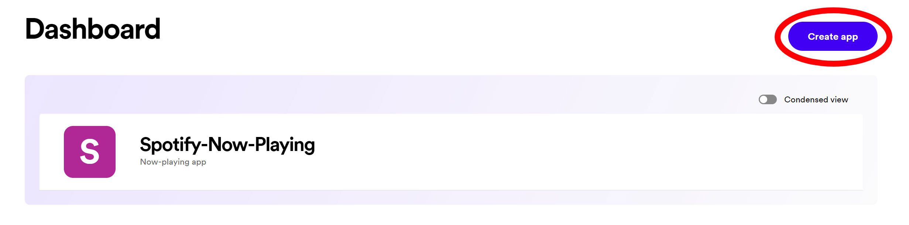
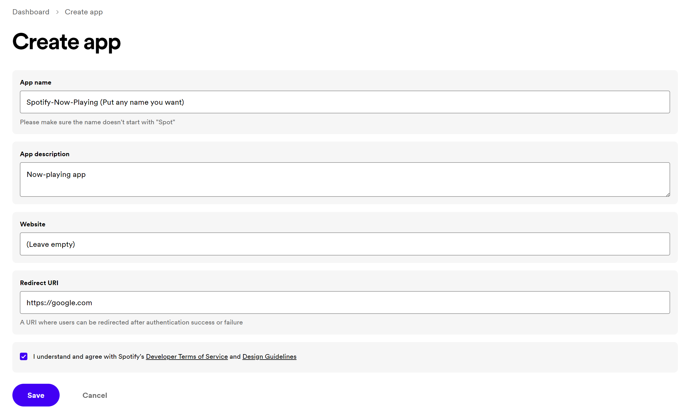
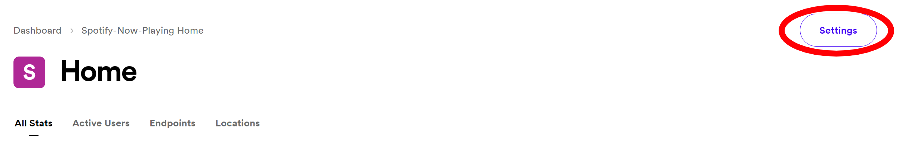
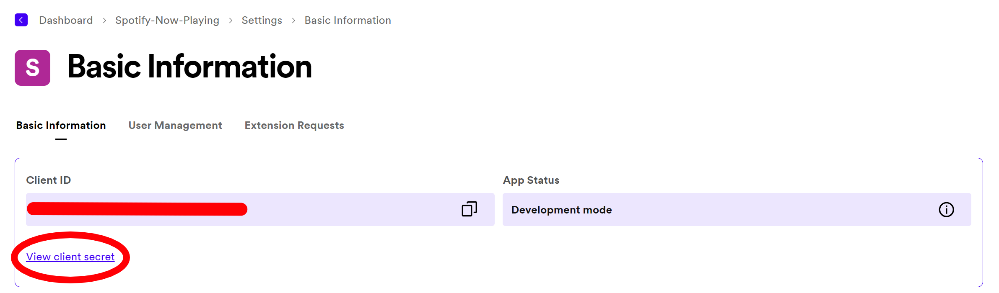
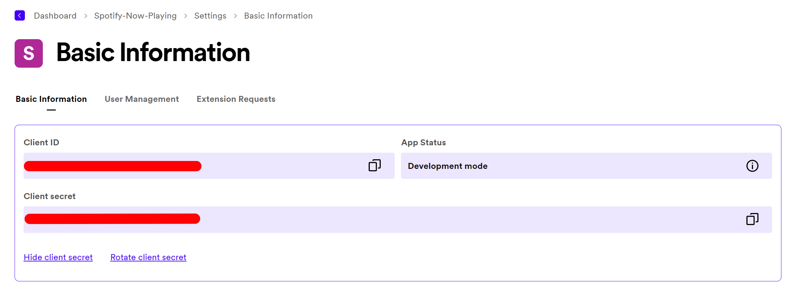
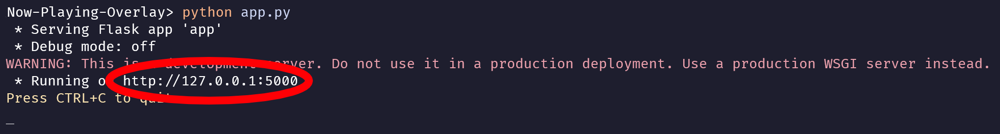
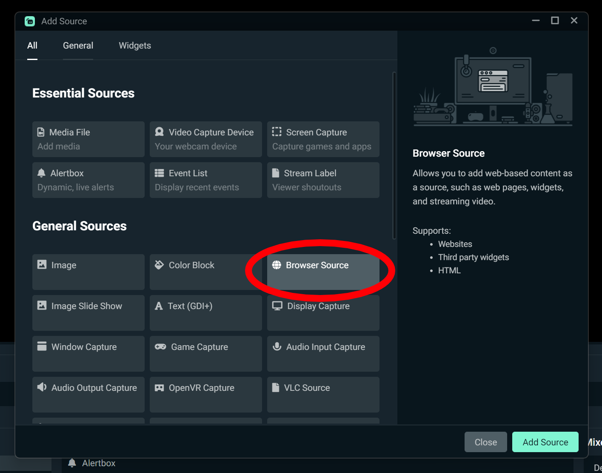

## [WIP] Spotify Now-Playing Stream Overlay

### Table of contents

1. [ Usage ](#usage)
2. [ Configuration ](#configuration)
3. [ TODO ](#todo)
   <a name="what"></a>

### What is this?

A small project that displays song currently playing

<a name="usage"></a>

### How to use?

1. Go to https://developer.spotify.com/dashboard and create your application.
   
   Your app details should be something like that. Click 'Save'.
   
2. Click on 'Settings'.
   
   You will be brought to this page.
   
   Click on 'View client secret'.
   
   Copy both the Client ID and Client secret values (censored on the screenshot).
3. Click on 'Code' and download the zip file (of course unzip it).
   You could also use git, run
   ```
   git clone "https://github.com/caffeinated01/Now-Playing-Overlay"
   ```
   
4. Right click on the folder, then press 'Open in Terminal' then run
   ```
   pip install -r requirements.txt
   ```
   and
   ```
   mv "(rename to .env)" .env
   ```
   Then open up the file (which is .env) and replace the Client ID and Client secret values from earlier.
   
5. Run the code - in the terminal, run

```
python app.py
```

Then CTRL+CLICK on the link (http://127.0.0.1:5000 in the case of the screenshot).
 6. Add a 'Browser Source'
Click 'Add a new source instead', and 'Add Source'. Under URL, enter the link from the previous step. Under 'Width' and 'Height' enter 800 and 150 respectively. Whenever you restart the app, go into the settings of browser source and refresh cache.


7. All set! When you want to stop the program, go back to terminal and press CTRL+C. Note that the overlay only works when you are running it in the terminal.

<a name="configuration"></a>

### How to configure?

The configuration file is located at the root directory, named `config.json`. Open with any text editor and the default values are as such:

```
{
  "MAX_ARTIST_LEN" : 20,
  "MAX_NAME_LEN" : 39,
  "ARTIST_COLOR": "#96d1fc",
  "TITLE_COLOR": "#ffffff",
  "BACKGROUND_COLOR": "#131313",
  "WIDTH": 800,
  "FLIP": true
}
```

1. Basic frontend settings

   a. The 'max artist length' property is the max length of an artist's name that is displayed.
   b. The 'max name length' proprety is the max length of a song's name that is displayed.
   c. The 'artist color' property is the color of the artist's name that is displayed.
   d. The 'title color' property is the color of the song's name that is displayed.

      - Note that the colors **must be in hexadecimal**.

   e. The 'background color' property is the color of the overlay background displayed
   f. The 'width' property is the width of the overlay displayed

      - Note that the width you enter in the config must correspond with the width for your browser source in streamlabs/obs

   g. The 'flip' property is the orientation of the overlay.
      - Values can only be true (flip around) or false (don't flip around)

2. Images to display when nothing is being played
   - Navigate to `./static/default_covers`
   - Here you will find some default images I have thrown in, delete them and put in your own images that you want to display when there is nothing being played.

<a name="todo"></a>

### TODO

nothing atm
