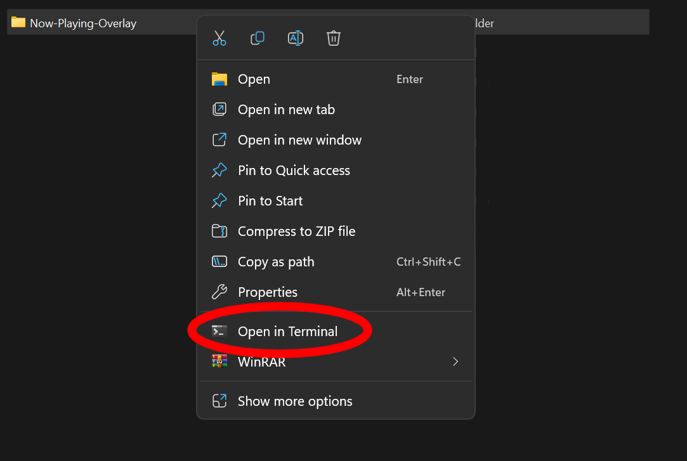

## [WIP] Spotify Now-Playing Stream Overlay

#### What is this?

A small project that displays song currently playing

#### How to use?
Before you begin:
Go to Spotify for developers and create your application and copy the client ID, secret somewhere.
1. Click on 'Code' and download the zip file (of course unzip it)
   You could also use git, run `git clone "https://github.com/caffeinated01/Now-Playing-Overlay"`
   
2. Right click on the folder, then press 'Open in Terminal' then run `pip install -r requirements.txt` also, rename the template file to '.env' and replace the ID and secret values from earlier.
   
3. Run the code - in the terminal, run `python app.py` then ctrl+click on the link (http://127.0.0.1:5000)
   
4. Add a 'Browser Source'
   Click 'Add a new source instead', and 'Add Source'. Under URL, enter the link from the previous step. Under 'Width' and 'Height' enter 800 and 150 respectively.
   

5. All set! When you want to stop the program, go back to terminal and press ctrl+c. Note that the overlay only works when you are running it in the terminal

#### How to configure?

Coming soon...
